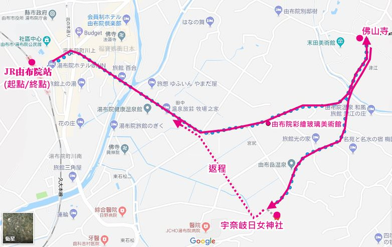

# Day 4
> * `9:17 ~ 11:31` 搭乘 __由布院之森1號__ 從博多到由布院站
> * 由於該地區的主要景點大多集中在JR「由布院站」週邊，因此若以車站為起點，步行1小時內即可遊覽各種觀光景點。如果想去距離車站稍遠的地方時，建議搭乘計程車或租車造訪

## 由布院遊客中心
* 提供臨時寄存行李
* 建築物採用全玻璃幕牆

## 由布釜飯．心 湯布院站前店
* 位於車站附近，可以第一天到吃飯
* 營業時間: `10:30–20:30`

## 觀光辻馬車
* 第一天吃完 由布釜飯 之後可以搭馬車
* 購票處：由布院溫泉觀光案內所(JR由布院站內)，或電話預約0977-84-2446
* 大人票價：2200円
* 運行時間：09:30、10:00、11:00、11:30、12:30、13:00、14:00、14:30、15:30、16:00
* 路線：由布院站→佛山寺→宇奈岐日女神社→由布院站，中途每站約停留10~15分鐘
* 全程50分鐘

_馬車路線圖_

參考網站: https://gogojp.tw/yufuin-carriage/

## 由布院ステンドグラス美術館
> 在旅館以東徒步8分鐘，似乎馬車會經過，應該不用特別過去
