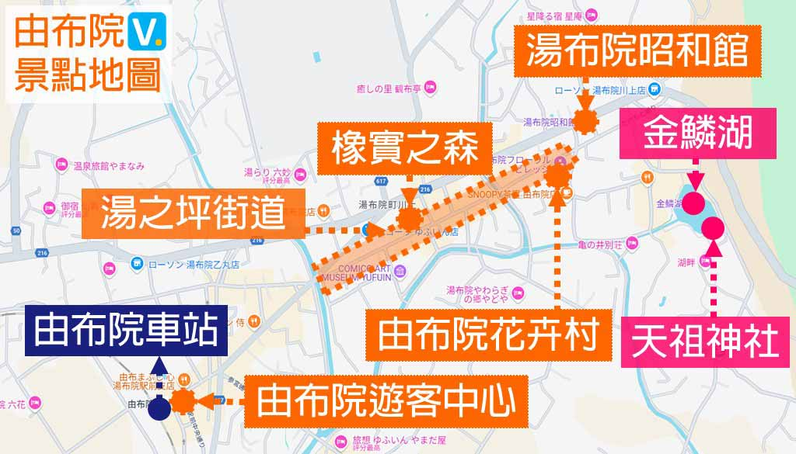

Day 5 （10/7 周二）
========
> `10:30` 前退房

[參考網站](https://vivianjourney.tw/yufuin/)

## 湯之坪街道
* [B-speak](https://www.gltjp.com/zh-hant/directory/item/14889/) 的蛋糕捲
* 使用豐後牛製作的「由布院漢堡」等必吃美食

## 湯布院花卉村
* 以英國科茨沃爾德小鎮為藍圖的主題公園，像走進童話世界般
* 園區內分布特色主題商店
* 推薦去賣吉卜力與彼得兔周邊商品的商店

## 天祖神社
就在金鱗湖

## 由布釜飯 「心」金鱗湖本店
* 營業時間: `10:30–17:30`
* 與湯布院站前店 擇一

## 食物
除了 __由布釜飯__ 與 __蛋糕卷B-SPEAK__ 必吃外，這些也不錯：
* [拉麵侍](https://www.gltjp.com/zh-hant/article/item/20870/)
* 湯布院金賞コロッケ（可樂餅）
* Milch半熟芝士蛋糕
* Canelé Carandonel

## 由布岳
> 自 JR 由布院車站搭巴士至「由布登山口」下車約15分鐘
> 大概率不會去

* 狹霧台：距離不近，適合自駕

## 晚餐 
* 烤雞皮
* 中洲屋台街
* 祇園 鐵鍋煎餃